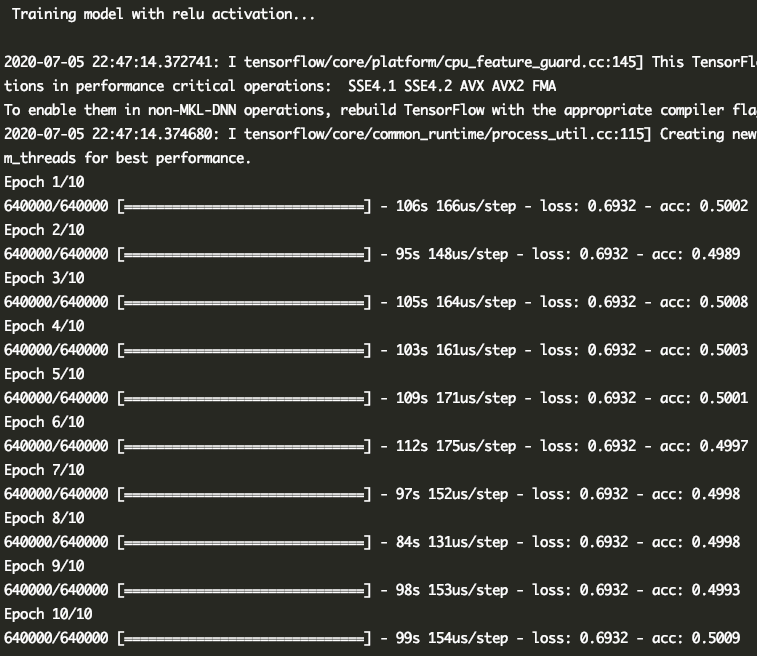
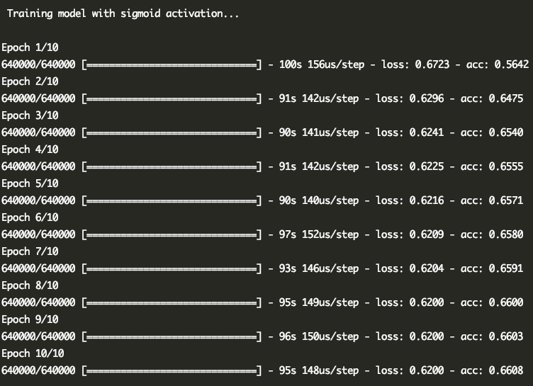
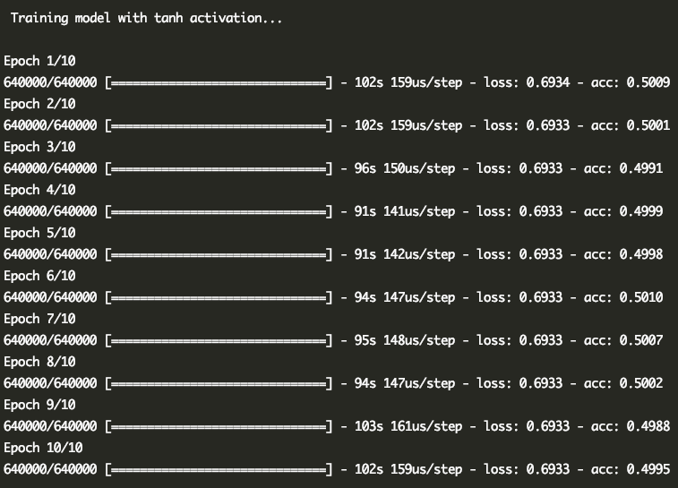

# Report - Assignment 4

The following accuracies are for different activation functions 
on the hidden layer.

## Results

| Activation Function | Accuracy |
| :-------------: |:-------------:|
| ReLU | ~ 0.500|
| Sigmoid  | ~ 0.650 |
| Tanh  | ~ 0.500 |

## Analysis

- Effect of Activations - With `relu` activation, the model does not learn well.
With `sigmoid` activation, the training accuracy of the model increases significantly
from epoch 1 to epoch 10 (acc = 0.6608). The model learns slowly with sigmoid activation.
With `tanh` activation, the model shows similar learning behaviour as `relu`.

- The effect of L2-norm regularizer is not significant on the dataset, i.e.
the accuracy of the model remains the same. As the model is not overfitting in
any scenario, by introducing L2-norm the accuracy does not improve or decay.

- When dropout layer is added to the model, the effect on the accuracy is not significant enough as the model
is not overfitting. By deactivating few neurons, the effect on accuracy is not observed.

- Training Results: 

